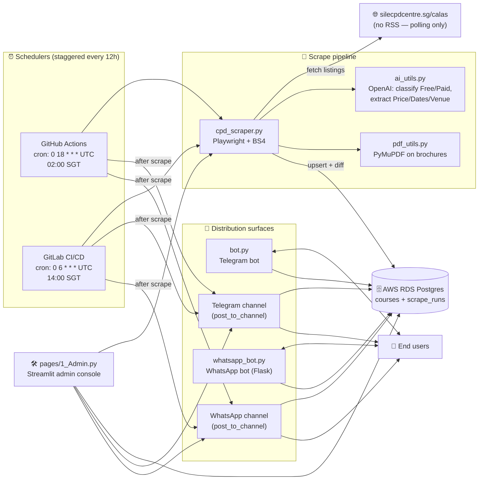
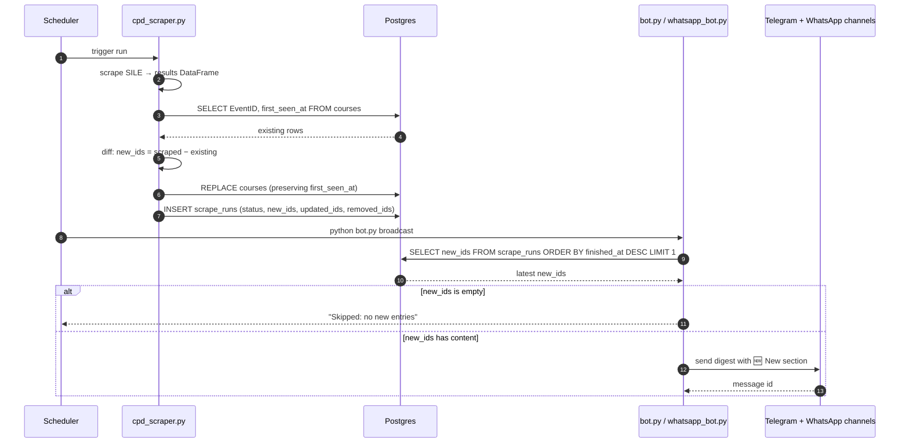

# SILE CPD Tracker

Automated tracker for Continuing Professional Development (CPD) courses listed on the [Singapore Institute of Legal Education CALAS site](https://www.silecpdcentre.sg/calas/). The system scrapes the public CALAS table on a 12-hourly schedule, AI-classifies each course (free vs paid, MEC/ethics segment, etc.), persists results to AWS RDS Postgres, and pushes new entries to four end-user surfaces:

1. **Telegram bot** — interactive DMs (`/free`, `/search`, `/stats`).
2. **Telegram channel** — broadcast digest of newly-discovered courses.
3. **WhatsApp bot** — same commands via Meta Cloud API webhook.
4. **WhatsApp channel** — broadcast digest mirror.

A password-gated **Streamlit admin console** lets you trigger off-schedule scrapes, view run history, and manually broadcast.

---

## Architecture

### High-level flow



### Diff-aware broadcast (why duplicates are impossible)



The two schedulers (GitHub and GitLab) read the same `scrape_runs` audit table. The runner that fires second sees the first runner's results, computes `new_ids = []`, and skips the broadcast — so the channels are never spammed.

---

## Repository layout

```
cpd/
├── cpd_scraper.py          # Playwright scraper + diff/audit (writes courses + scrape_runs)
├── ai_utils.py             # OpenAI metadata extraction
├── pdf_utils.py            # PDF brochure text extraction
├── bot.py                  # Telegram bot + channel broadcaster
├── whatsapp_bot.py         # WhatsApp bot (Flask webhook) + channel broadcaster
├── app.py                  # Streamlit user-facing dashboard
├── pages/
│   └── 1_Admin.py          # Streamlit admin console (password-gated)
├── setup_db.py             # One-shot helper to seed RDS from local CSV
├── .github/workflows/
│   └── scrape.yml          # GitHub Actions cron (02:00 SGT)
├── .gitlab-ci.yml          # GitLab CI/CD pipeline (cron set in UI: 14:00 SGT)
└── requirements.txt
```

---

## Database schema

Two tables in the `DATABASE_URL` Postgres instance:

| Table          | Columns (key fields)                                                                                  | Written by              |
|----------------|-------------------------------------------------------------------------------------------------------|-------------------------|
| `courses`      | `EventID`, `Title`, `Organiser`, `Date`, `Price`, `Is_Free`, `Public_CPD_Points`, `MEC_Segment`, `External_Link`, `Last_Scraped`, **`first_seen_at`** | `cpd_scraper.py`        |
| `scrape_runs`  | `started_at`, `finished_at`, `status`, `error`, `new_ids` (JSON), `updated_ids` (JSON), `removed_ids` (JSON), `new_count`, `updated_count`, `removed_count` | `cpd_scraper.py`        |

`first_seen_at` is preserved across runs by reading the existing table and merging on `EventID` before re-writing. `scrape_runs` is append-only and powers diff-aware broadcasts plus the admin **Run history** tab.

---

## Schedule

| Provider          | Cron (UTC)     | Local (SGT) | Configured in                                                                 |
|-------------------|----------------|-------------|-------------------------------------------------------------------------------|
| GitHub Actions    | `0 18 * * *`   | 02:00       | [`.github/workflows/scrape.yml`](.github/workflows/scrape.yml)                |
| GitLab CI/CD      | `0 6 * * *`    | 14:00       | GitLab UI → Project → CI/CD → Schedules (the `.gitlab-ci.yml` only declares the jobs) |

Both runners use the `mcr.microsoft.com/playwright/python:v1.47.0-jammy` container so Chromium is available without extra setup.

---

## Required environment variables

Create a local `.env` for development and mirror these as **GitHub Secrets** + **GitLab CI/CD Variables** for the schedulers, and **Streamlit Cloud Secrets** for the admin console.

| Variable                  | Used by                                         | Notes                                              |
|---------------------------|-------------------------------------------------|----------------------------------------------------|
| `DATABASE_URL`            | scraper, bots, admin                            | Postgres connection string (AWS RDS).              |
| `OPENAI_API_KEY`          | `ai_utils.py`                                   | For metadata classification.                       |
| `ADMIN_PASSWORD`          | `pages/1_Admin.py`                              | Password gate for the Streamlit admin.             |
| `TELEGRAM_BOT_TOKEN`      | `bot.py`                                        | From [@BotFather](https://t.me/BotFather).         |
| `TELEGRAM_CHANNEL_ID`     | `bot.py` (channel posts)                        | `@your_channel` or `-100…` numeric id.             |
| `TELEGRAM_ADMIN_ID`       | `bot.py` (admin `/broadcast` cmd)               | Numeric Telegram user id.                          |
| `WHATSAPP_TOKEN`          | `whatsapp_bot.py`                               | Meta Cloud API permanent token.                    |
| `WHATSAPP_PHONE_ID`       | `whatsapp_bot.py`                               | WhatsApp sender phone-number id.                   |
| `WHATSAPP_VERIFY_TOKEN`   | `whatsapp_bot.py` (webhook handshake)           | Random string you choose.                          |
| `WHATSAPP_CHANNEL_ID`     | `whatsapp_bot.py` (channel posts)               | Channel id or broadcast destination.               |
| `FORCE_BROADCAST`         | GitLab pipeline (optional)                      | `"true"` overrides the no-new-entries guard.       |

---

## Running locally

```bash
pip install -r requirements.txt
playwright install chromium

# 1. Scrape (writes to DATABASE_URL or falls back to cpd_courses.csv)
python cpd_scraper.py --limit 5            # quick test run

# 2. Telegram bot (long-running, polls Telegram)
python bot.py

# 3. Telegram channel post (one-shot, broadcasts new entries)
python bot.py broadcast                    # skips if nothing new
python bot.py broadcast --force            # post regardless

# 4. WhatsApp webhook (long-running Flask server on :5000)
python whatsapp_bot.py

# 5. WhatsApp channel post (one-shot)
python whatsapp_bot.py broadcast

# 6. Streamlit dashboards
streamlit run app.py                       # public dashboard + Admin page in sidebar
```

---

## Admin console

`pages/1_Admin.py` (visible in the Streamlit sidebar after `streamlit run app.py`):

| Tab               | What it does                                                                                                |
|-------------------|-------------------------------------------------------------------------------------------------------------|
| ▶️ Run scrape      | Triggers `run_scraper()` synchronously with a progress bar. Optional `limit` for quick tests.               |
| 📜 Run history    | Last 30 rows of `scrape_runs` with new/updated/removed counts and any error message.                       |
| 🆕 New entries    | Filtered `courses` view of EventIDs added in the most recent successful run.                                |
| 📢 Manual broadcast | Per-channel **Post** buttons with a **Force** toggle that bypasses the no-new-entries skip.                |
| ⏰ Schedule        | Read-only summary of the staggered cron config across both providers, with deep links to the YAML files.    |

The console is gated by `ADMIN_PASSWORD` — if the env var is missing, the page refuses to load.

---

## Deployment

| Component                  | Where it runs                              |
|----------------------------|--------------------------------------------|
| Scraper (cron)             | GitHub Actions + GitLab CI/CD (free tiers) |
| Telegram bot poller        | Long-running process (your VPS / Docker)   |
| WhatsApp webhook (Flask)   | Public HTTPS endpoint registered with Meta |
| Streamlit app + admin      | Streamlit Cloud                            |
| Postgres                   | AWS RDS                                    |

**Why dual schedulers?** The repo has both `github` and `origin` (GitLab) remotes wired up. Running the cron on both (12h apart) gives twice-daily polling without duplicate broadcasts — the diff-aware digest deduplicates via the shared `scrape_runs` table.

---

## Notes & caveats

- **No RSS upstream.** silecpdcentre.sg has no feed or webhook (verified directly). Polling + diff is the only path. If they ever expose one, we can replace the schedulers with a webhook listener.
- **WhatsApp Channels API** is in limited rollout from Meta. If your account doesn't have programmatic-channel access, point `WHATSAPP_CHANNEL_ID` at a broadcast list or a single test recipient as a fallback.
- **First run after this change** will mark *all existing courses* as "new" (because `first_seen_at` is being initialised). Either trigger that run while `TELEGRAM_CHANNEL_ID`/`WHATSAPP_CHANNEL_ID` are blank, or manually set `first_seen_at` on the existing rows before letting the cron fire.
